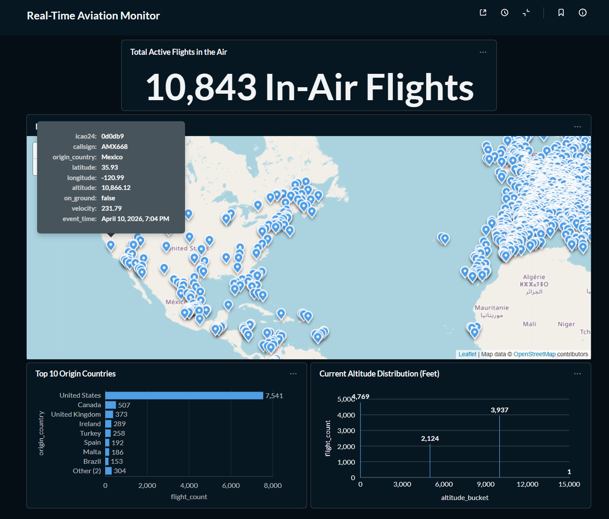

# Real-Time Aviation Data Pipeline

A distributed data pipeline built to demonstrate the integration of **Apache Kafka** and **PySpark Structured Streaming**. This project focuses on the low-latency ingestion of high-velocity aviation state vectors, transforming raw API data into structured, actionable insights.


## Core Pipeline Logic
The project is designed as a linear, high-throughput stream:

1.  **Event Generation:** A Python producer acts as a data gateway, polling the OpenSky API and decomposing batch responses into individual flight events to ensure atomic processing.
2.  **Message Brokering:** **Kafka (KRaft Mode)** serves as a resilient buffer, decoupling the data source from the processing engine to handle spikes in API volume.
3.  **Distributed Processing:** **PySpark** consumes the Kafka topic, enforces a strict data contract via `StructType` schemas, and cleanses geospatial coordinates in real-time.
4.  **Operational Sink:** Data is persisted to **PostgreSQL** using the `foreachBatch` sink pattern, enabling immediate visualization via **Metabase**.

## Tech Stack
* **Language:** Python
* **Stream Ingestion:** confluent-kafka (Docker containerized)
* **Databases:** PostgreSQL (Docker containerized)
* **Visualization:** Metabase (Docker containerized)
* **Tools:** Requests, Docker, python-dotenv, Git/GitHub

## Engineering Highlights
* **Atomic Event Modeling:** Rather than processing bulk JSON payloads, I implemented a per-flight event model. This allows the Spark engine to distribute the workload effectively across its executors.
* **Schema Enforcement:** Defined explicit `StructType` schemas to ensure data integrity. This prevents "poison pill" messages or malformed JSON from crashing the streaming query.
* **Containerized Networking:** Managed a complex Docker network setup where the host-side Spark engine communicates with containerized Kafka and Postgres instances across mapped ports.

## Deployment
### Prerequisites
* Docker Desktop
* PySpark installed and configured locally

### 1.Clone the repository:
```bash
git clone https://github.com/Chanpitou/Aviation-Data-Pipeline
cd Aviation-Data-Pipeline
```
### 2. Spin up Infrastructure
```bash
docker-compose up -d
```
### 3. Environment Setup
Create a .env file with the following:
```bash
STREAM_POSTGRES_PASSWORD=your_password
MB_POSTGRES_PASSWORD=your_password
```
### 4. Run Producer
```bash
python send_to_kafka.py
```
### 5. Run PySpark Consumer
```bash
spark-submit --packages org.apache.spark:spark-sql-kafka-0-10_2.13:3.5.5,org.postgresql:postgresql:42.7.2 spark_consumer.py
```
### 6. Access/Customized Visualization (Metabase)
```bash
Navigate to localhost:3000 to access the Metabase dashboard
```

## Results
The final result is a live-updating dashboard that monitors 10,000+ simultaneous flight vectors with sub-minute latency from the source API to the final visualization.

* **Geospatial Map:** Real-time location tracking.
* **Fleet KPI:** Unique aircraft count in the current stream window.
* **State Analysis:** Distribution of altitudes and origin countries.

## Future Enhancements
* Implement a DataLake sink for long-term historical storage.
* Add a Stream Ingestion layer for airline schedule metadata to calculate live flight delays.
* Integrate dbt within pipeline to further transform data, and store the transformed data in a Warehouse like Snowflake.