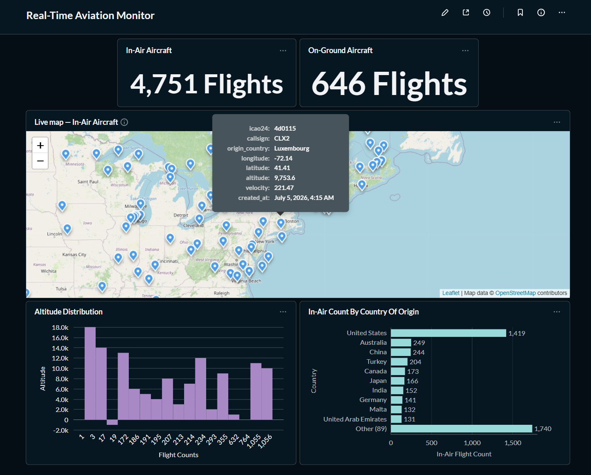

# Real-Time Aviation Data Pipeline

A distributed data pipeline built to demonstrate the integration of **Apache Kafka** and **PySpark Structured Streaming**. This project focuses on the low-latency ingestion of high-velocity aviation state vectors, transforming raw API data into structured, actionable insights.


## Core Pipeline Logic
The project is designed as a linear, high-throughput stream:

1.  **Event Generation:** A Python producer acts as a data gateway, polling the OpenSky API and decomposing batch responses into individual flight events to ensure atomic processing.
2.  **Message Brokering:** **Kafka (KRaft Mode)** serves as a resilient buffer, decoupling the data source from the processing engine to handle spikes in API volume.
3.  **Distributed Processing:** **PySpark** consumes the Kafka topic, enforces a strict data contract via `StructType` schemas, and cleanses geospatial coordinates in real-time.
4.  **Operational Sink:** Data is persisted to **PostgreSQL** using the `foreachBatch` sink pattern, enabling immediate visualization via **Metabase**.

## Tech Stack
* **Language:** Python
* **Message Broker:** Apache Kafka (KRaft mode, Docker containerized)
* **Stream Processing:** Apache Spark / PySpark Structured Streaming (Docker containerized)
* **Databases:** PostgreSQL (Docker containerized)
* **Visualization:** Metabase (Docker containerized)
* **Libraries:** confluent-kafka, requests, python-dotenv
* **Tools:** Docker, Git/GitHub

## Engineering Highlights
* **Atomic Event Modeling:** Rather than processing bulk JSON payloads, I implemented a per-flight event model. This allows the Spark engine to distribute the workload effectively across its executors.
* **Schema Enforcement:** Defined explicit `StructType` schemas to ensure data integrity. This prevents "poison pill" messages or malformed JSON from crashing the streaming query.
* **Containerized Spark Cluster:** Spark master, worker, and the streaming consumer all run as Docker services on the same network as Kafka and Postgres, so the whole pipeline comes up with a single `docker compose up`.
* **Dual-Listener Kafka Networking:** Kafka is configured with separate internal (`kafka:9092`) and external (`localhost:29092`) listeners, so the containerized consumer and the host-side producer can each resolve the broker correctly without one breaking the other.

## Project Structure
```
src/
  producer/send_to_kafka.py   # polls OpenSky API, publishes flight events to Kafka (runs on host)
  consumer/spark_consumer.py  # Spark Structured Streaming job, Kafka -> Postgres (runs in Docker)
sql/                           # Metabase analysis queries, version-controlled
docker-compose.yml             # Kafka, Spark cluster, Postgres, Metabase services
Dockerfile.spark-master
Dockerfile.spark-worker
Dockerfile.spark-submit         # bakes in and runs src/consumer/spark_consumer.py
requirements.txt                # producer dependencies (installed on host)
```

## Deployment
### Prerequisites
* Docker Desktop
* Python 3.x (only needed to run the producer, which polls the API from your host)

### 1. Clone the repository:
```bash
git clone https://github.com/Chanpitou/Aviation-Data-Pipeline
cd Aviation-Data-Pipeline
```
### 2. Environment Setup
create and setup `.env` and fill in your own values:
```bash
MB_POSTGRES_PASSWORD=yourpassword
STREAM_POSTGRES_PASSWORD=yourpassword
```
### 3. Spin up Infrastructure
Builds and starts Kafka, the Spark cluster (master/worker/submit), Postgres, and Metabase. The consumer (`src/consumer/spark_consumer.py`) runs automatically inside the `spark-submit` container — no separate step needed.
```bash
docker compose up -d --build
```
### 4. Run Producer
The producer runs on the host and publishes to Kafka's external listener (`localhost:29092`).
```bash
pip install -r requirements.txt
python src/producer/send_to_kafka.py
```
### 5. Access/Customize Visualization (Metabase)
Navigate to `localhost:3000` to access the Metabase dashboard. Ready-to-use analysis queries live in [`sql/`](sql/).

### Rebuilding after changes
`spark_consumer.py` is baked into the `spark-submit` image at build time, so after editing it you need to rebuild that service specifically:
```bash
docker compose up -d --build spark-submit
```

## Results
The final result is a live-updating dashboard that monitors 10,000+ simultaneous flight vectors with sub-minute latency from the source API to the final visualization.

* **Geospatial Map:** Real-time location tracking.
* **Fleet KPI:** Unique aircraft count in the current stream window.
* **Ground Status:** Live count of on-ground vs. in-air aircraft.
* **State Analysis:** Distribution of altitudes and origin countries.

## Future Enhancements
* Implement a DataLake sink for long-term historical storage.
* Add a Stream Ingestion layer for airline schedule metadata to calculate live flight delays.
* Integrate dbt within pipeline to further transform data, and store the transformed data in a Warehouse like Snowflake.